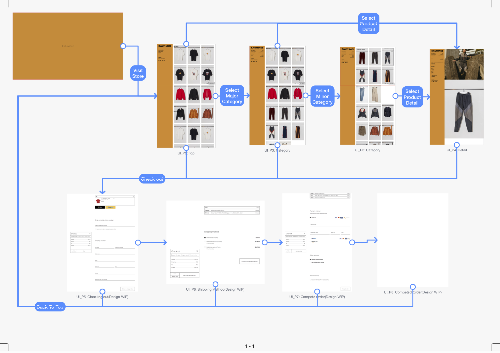
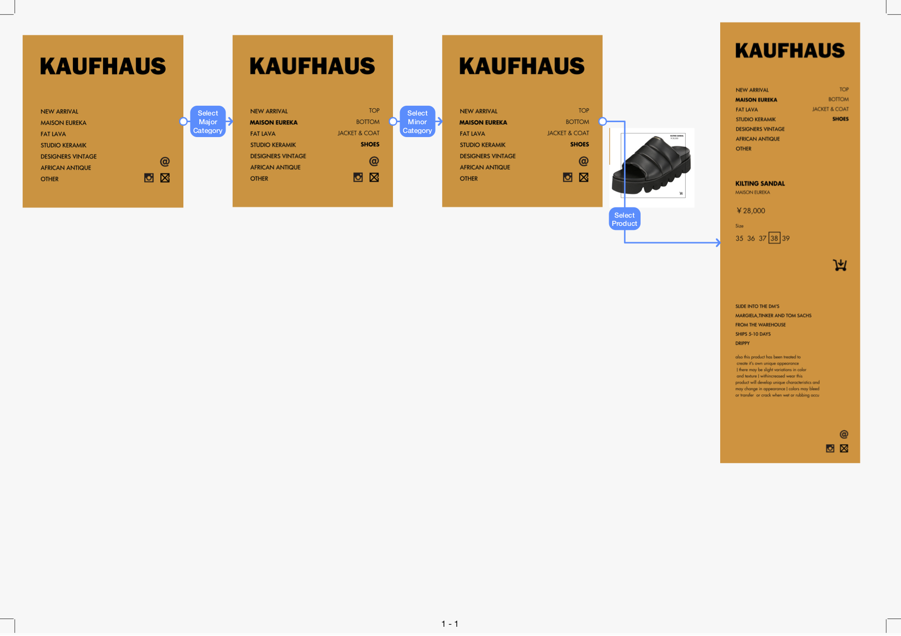

# Index

1. 発注範囲、前提等
2. 画面構成概要、画面数について
3. 画面遷移図
4. 画面詳細仕様書
5. 画面遷移詳細仕様書
6. 共通事項

# 1. 発注範囲、前提等

1. ShopifyベースでECサイトを構築しており、UI部分の構築をお願いしたい
2. PCブラウザでの閲覧用のUIのみを構築する
  * SP用のUI，レスポンシブの考慮は現時点では必要ない
  * SPのブラウザで閲覧する際は、PC用のUIがそのまま表示される形でよい
3. 商品閲覧〜カート追加までの間、クリックアクションに対するUIの動作は、画面のリロードを発生させず、JSによるUIの変化とデータの変化により実現する
  * 詳細は後述
  * これは最も重要な要件の一つで、それ以外の詳細については交渉により作業量をへらすことも可能
4. ViewとModel, Controllerは分離できる形でJS実装したい
  * 今回の発注範囲は、JSによるUIの動きの実装部分になるが、Shopifyとの通信やデータ処理を追加しやすいよう、Viewの実装からそれらを切り離せる実装にしたい

# 2. 画面構成概要、画面数について

## 概要

* 総画面パターン数: 8
* コントロールプレインのパターン数: 4? TBD
  * コントロールプレインとは、商品閲覧〜カート追加までの間、遷移先リンク集として使ったり、商品詳細ページでは商品詳細を表示したりする部品のこと。画像イメージは後述の画面詳細等に記載
  * !!余談!! このコントロールプレインは、商品閲覧〜カート追加までの間、UIから消えることなく常に表示させておく（画面全体のリロードが起こらないように閲覧内容の変化を実現する）実装にしたい、というのが今回の最も重要な要件の一つ

## 画面一覧

|パターンID|パターン名|概要|
|:--|:--|:--|
|[UI_P1](UIDetail/UI_P1_Introduction/detail.md)|Introduction|Welcomeメッセージが表示される画面|
|[UI_P2](UIDetail/UI_P2_Top/detail.md)|Top|商品が閲覧できるトップページ。TBD が表示される画面|
|[UI_P3](UIDetail/UI_P3_Category/detail.md)|Category|コントロールプレインで選択したカテゴリの商品が一覧表示される画面|
|[UI_P4](UIDetail/UI_P4_Detail/detail.md)|Detail|Categoryページで選択した特定商品の詳細が表示される画面|
|UI_P5|Checking out|カートに入れた商品の購入を開始する画面。住所等を入力|
|UI_P6|Shipping Method|配送方法を選択する画面|
|UI_P7|Completing Order|支払いに関する情報を登録/選択し、注文を完了する画面|
|UI_P8|Competed Order|注文が完了したあとに表示される画面|

## コントロールプレイン一覧

|パターンID|パターン名|概要|
|:--|:--|:--|
|[CT_P1](CTDetail/CT_P1_Initial/detail.md)|Initial|Initial View|初期状態|
|[CT_P2](CTDetail/CT_P2_MajorCategorySelected/detail.md)|Major Category Selected|コントロールプレインの大カテゴリが選択されている状態。例えば、NEW ARRIVAL, MAISON EUREKA など|
|[CT_P3](CTDetail/CT_P3_MinorCategorySelected/detail.md)|Minor Category Selected|Minor Category Selected|CT_P2で大カテゴリ選択後、例えば、TOP, BOTTOM, SHOES などの小カテゴリが選択されている状態|
|[CT_P4](CTDetail/CT_P4_ProductDetail/detail.md)|Product Detail|Product Detail|特定商品を選択した際に表示。価格やサイズ、商品の解説文章などを表示|

# 3. 画面遷移図

## 画面遷移図

* Check Out画面への遷移は、一覧、詳細画面に必ずある"YOUR CART"ボタンをクリックすることで遷移する

## コントロールプレイン遷移図

# 4. 画面詳細仕様書

## 画面

* [UI_P1](CTDetail/UI_P1_Introduction/detail.md)|Introduction
* [UI_P2](CTDetail/UI_P2_Top/detail.md)|Top
* [UI_P3](CTDetail/UI_P3_Category/detail.md)|Category
* [UI_P4](CTDetail/UI_P4_Detail/detail.md)|Detail
* UI_P5
* UI_P6
* UI_P7
* UI_P8

## コントロールプレイン

* [CT_P1](CTDetail/CT_P1_Initial/detail.md)|Initial
* [CT_P2](UIDetail/CT_P2_MajorCategorySelected/detail.md)|Major Category Selected
* [CT_P3](UIDetail/CT_P3_MinorCategorySelected/detail.md)|Minor Category Selected
* [CT_P4](UIDetail/CT_P4_ProductDetail/detail.md)|Product Detail

# 5. 画面遷移詳細仕様書

* [Visit Store(Introduction -> Top)](SegueDetail/VisitStore/detail.md)
* [Select Category(Top -> Category)](SegueDetail/SelectCategoryMajor/detail.md)
* [Select Category(Category -> Category)](SegueDetail/SelectCategoryMajor/detail.md)
* [Select Product Detail(Category -> Product)](SegueDetail/SelectProductDetail/detail.md)
* [Check Out(各ページ -> Checking out)](SegueDetail/CheckOut/detail.md)

# 6. 共通事項

* 基本的にフォントは以下の優先順位で設定
  * Architype Renner, TBD, TBD
