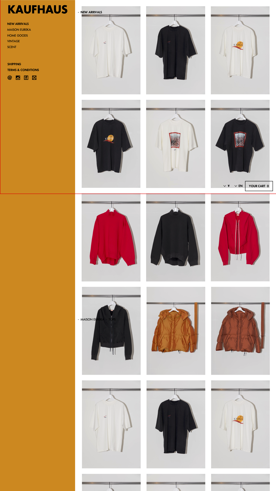

# [UI_P2](UIDetail/UI_P2_Top/detail.md)|Top

## 説明

* [前画面からこの画面への遷移(表示)方法は、こちらを参照]()

## コントロールプレーン

* [コントロールプレイン初期状態はこちらを参照]()
* 商品一覧をスクロールしても、画像の赤枠内の状態でとどまり続ける。

## 一覧部分の詳細

* 以下の順番ですべての商品を表示する
  * カテゴリ問わず、"すべての商品が表示されている"ことが重要
  * 次の画面で説明するカテゴリ選択時の挙動にといては、「選択したカテゴリの情報をロードし画面をロードする」のではなく、「すでに表示されている場所にスクロールする」という挙動になることに注意

* 商品一覧部の初期表示は、NEW ARRIVALS(表示内容は後述)が選択された状態にする
* 一覧部分の幅に合わせて、画像サイズを拡縮。画像は常に同じ幅で配置
* Category名と、通貨、言語、カートボタンは、画像の通り画面の枠に固定表示。スクロールしてもオーバーレイして同じ位置に存在するようにする
* 商品は2列以上、3列まで。その境目は、画面サイズが TBD のとき

## NEW ARRIVALS で表示する内容について

* 登録日。最新更新日ではなく商品登録日時
* 最新の20点。20点を超えたものは登録日が古いものから押し出される
