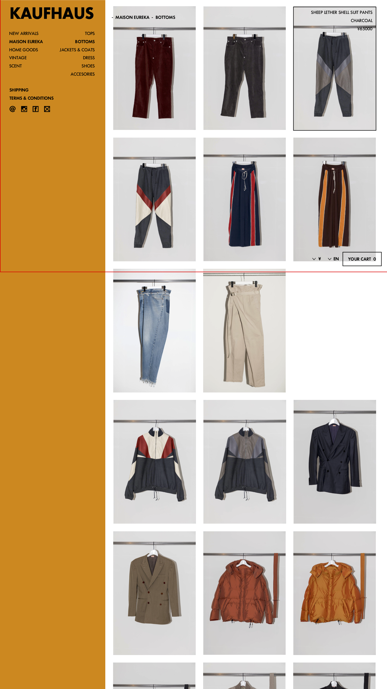

# [UI_P3](UIDetail/UI_P3_Category/detail.md)|Category

## 概要

* 大カテゴリ内の小カテゴリ(この場合 SHOES)を選択した場合、その小カテゴリのセクションに自動スクロールされて遷移する

## コントロールプレーンについて

* 選択した大カテゴリ(この場合 MAISON EUREKA)の商品のうち、少カテゴリの一番上のもの(この場合 TOPS)が選択された状態を初期表示
* 大カテゴリ選択時には、その中の小カテゴリが表示される
  * 少カテゴリは、コントロールプレーンの右はじからにょきっと出てくる形にしたい

## 商品一覧について

* 選択した大カテゴリ(この場合 MAISON EUREKA)の商品のうち、少カテゴリの一番上のもの(この場合 TOPS)の商品 一覧が、最新登録日 の 降順で初期表示される
  * !!前提!! 前画面でも説明済みだが、この画面ではすべての商品が商品一覧部に表示されている。カテゴリ選択時には、そのカテゴリの部分に画面がスクロールすることで遷移し、UI全体のリロードが発生しないように実装する。

* 一覧上の商品にかぶる形で、今どの位置にスクロールしているか（どのカテゴリを選択しているか）を示す、「- MAISON EUREKA - TOPS」などの文字が表示されている。これは常に画面の同じ位置（視認できる範囲は赤枠で示している）に表示される形にしたい。
  * 参考1: https://www.ssense.com/en-jp/women
  * 参考2: https://www.vooberlin.com/women/?p=2
  * スクロールによりカテゴリが変わる場合（コントロールプレインからカテゴリ選択した場合も同義)、カテゴリの文字の入れ替わりは、タイピングのような動きで消え、そして出現するようにしたい
    * 参考:  https://ityped.surge.sh
   * 小カテゴリ選択時も、小カテゴリ分の文字がタイピングのような動きで追記されるようにしたい

# 商品一覧部の更に詳細

### 商品選択時のオーバーレイについて

* 黒縁と最低限のdetailが出てくる
  * 商品名、色、価格
