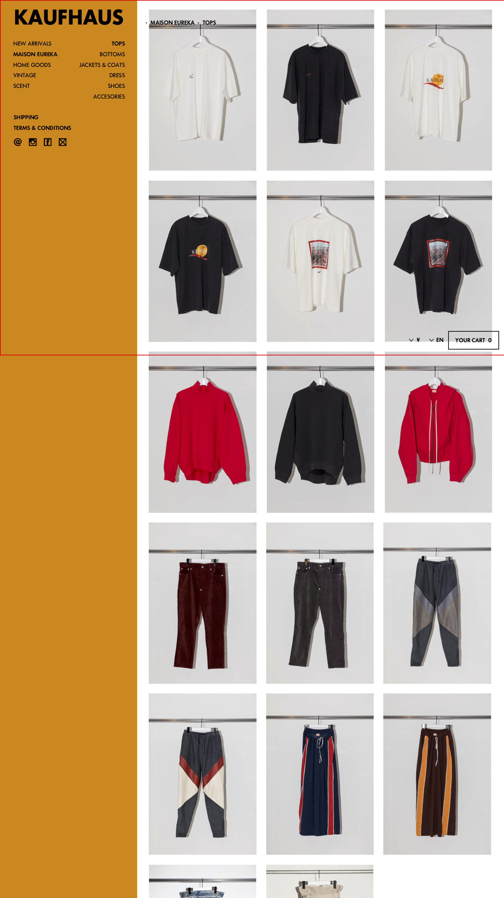

# [UI_P3](UIDetail/UI_P3_Category/detail.md)|Top

## 説明

1. [コントロールプレイン状態はこちらを参照]()
2. 選択した大カテゴリ(この場合 MAISON EUREKA)の商品が 最新更新日 の 降順で表示される
  * 初期状態では小カテゴリは TBD が選択された状態にする
  * 商品表示部分は、小カテゴリごとに別ページにするのではなく、すべての商品をカテゴリ別にセクション区切って1ページにすべて表示する
3. 大カテゴリ内の小カテゴリ(この場合 SHOES)を選択した場合、その小カテゴリのセクションに自動スクロールされて遷移する
