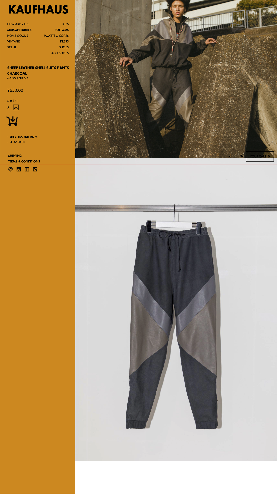

# [UI_P4](UIDetail/UI_P4_Detail/detail.md)|Detail

## 説明

* 商品一覧部が左側にずれこんで、右側から商品詳細ページが出てくる紙芝居形式

## コントロールプレーン

* [コントロールプレイン状態はこちらを参照]()
* "KAUFHAUS"だけは常に固定位置に表示し、それ以下の部分はスクロール可能にする
* 選択した商品の詳細が表示される
  * 商品名
  * ブランド名
  * 価格
  * サイズ
  * description 1
  * description 2

* 商品の色は一覧画面で選択するので、詳細画面では選択しない

* カートにマウスオーバーしたときに、カートにアニメーションがほしい
  * クリックしたらカートの数がインクリメントされる

## 商品表示部

* 商品画像を画面横幅いっぱいに表示
* この部分は画像のみを想定
